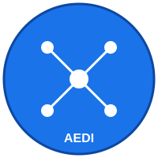

<div align="center">
  
  
  # NetworkZeroMonitor
  
  **Offline AI Mobile - Antwerp Designs Ecosystems Ionity (AEDI)**
  
  [](LICENSE)
  [](META.md)
  [](META.md)
</div>

---

## 📋 Overview

NetworkZeroMonitor is part of the AEDI (Antwerp Designs Ecosystems Ionity) ecosystem - an advanced offline AI mobile application designed for comprehensive network monitoring without requiring external network connectivity. This application enables zero-dependency network analysis and monitoring capabilities on mobile devices.

## 🎯 Key Features

- **Offline-First Architecture**: Full functionality without internet connection
- **AI-Powered Monitoring**: Advanced machine learning for network analysis
- **Cross-Platform**: Support for both Android and iOS devices
- **Zero External Dependencies**: Complete offline operation capability
- **Real-time Analytics**: Instant network monitoring and reporting
- **Lightweight**: Optimized for mobile device performance

## 📚 Documentation

This repository includes comprehensive documentation to help you get started:

- **[META.md](META.md)** - Project metadata and information
- **[FOLDER_STRUCTURE.md](FOLDER_STRUCTURE.md)** - Repository structure and organization
- **[INSTALLATION.md](INSTALLATION.md)** - Complete installation guide with step-by-step instructions
- **[SYSTEM_REQUIREMENTS.md](SYSTEM_REQUIREMENTS.md)** - System specifications, requirements, and space needed

## 🚀 Quick Start

### Prerequisites

Before you begin, ensure you meet the minimum system requirements:
- **RAM**: 8 GB minimum (16 GB recommended)
- **Storage**: 20 GB free disk space
- **OS**: Windows 10+, macOS 11+, or Ubuntu 20.04+

For complete requirements, see [SYSTEM_REQUIREMENTS.md](SYSTEM_REQUIREMENTS.md).

### Installation

1. Clone the repository:
```bash
git clone https://github.com/AntwerpDesignsIonity/Offline-Ai-Mobile-Antwerp-Designs-Ecosystems-Ionity-AEDI.git
cd Offline-Ai-Mobile-Antwerp-Designs-Ecosystems-Ionity-AEDI
```

2. Install dependencies:
```bash
npm install
```

3. Set up AI models:
```bash
npm run setup:models
```

4. Build the application:
```bash
npm run build
```

For detailed installation instructions, refer to [INSTALLATION.md](INSTALLATION.md).

## 📱 Platform Support

### Android
- **Minimum**: Android 7.0 (API 24)
- **Recommended**: Android 12+ (API 31+)
- **Architecture**: ARM64, x86_64

### iOS
- **Minimum**: iOS 13.0
- **Recommended**: iOS 16.0+
- **Devices**: iPhone 8+, iPad (6th gen)+

## 🏗️ Project Structure

```
Offline-Ai-Mobile-Antwerp-Designs-Ecosystems-Ionity-AEDI/
├── logo.svg                    # Project logo
├── README.md                   # This file
├── META.md                     # Project metadata
├── FOLDER_STRUCTURE.md         # Folder structure documentation
├── INSTALLATION.md             # Installation guide
└── SYSTEM_REQUIREMENTS.md      # System requirements
```

For the complete recommended structure, see [FOLDER_STRUCTURE.md](FOLDER_STRUCTURE.md).

## 💻 System Requirements

### Development Machine
- **Processor**: Dual-core 2.0 GHz minimum (Quad-core 3.0 GHz recommended)
- **RAM**: 8 GB minimum (32 GB recommended)
- **Storage**: 20 GB minimum (50 GB recommended)
- **OS**: Windows 10+, macOS 11+, or Linux (Ubuntu 20.04+)

### Mobile Device (End User)
- **RAM**: 2 GB minimum (4 GB recommended)
- **Storage**: 500 MB minimum (2 GB recommended)
- **OS**: Android 7.0+ or iOS 13.0+

For complete specifications, see [SYSTEM_REQUIREMENTS.md](SYSTEM_REQUIREMENTS.md).

## 🛠️ Development

### Building for Android
```bash
npm run android:build
```

### Building for iOS
```bash
npm run ios:build
```

### Running Tests
```bash
npm test
```

### Development Mode
```bash
npm run dev
```

## 📖 Additional Resources

- [Folder Structure Guide](FOLDER_STRUCTURE.md) - Understand the project organization
- [Installation Guide](INSTALLATION.md) - Detailed setup instructions
- [System Requirements](SYSTEM_REQUIREMENTS.md) - Hardware and software specifications
- [Project Metadata](META.md) - Project information and details

## 🤝 Contributing

We welcome contributions to the AEDI project! Please ensure your development environment meets the requirements outlined in [SYSTEM_REQUIREMENTS.md](SYSTEM_REQUIREMENTS.md).

## 📄 License

This project is licensed under the MIT License - see the LICENSE file for details.

## 📧 Contact

For questions, issues, or feedback:
- **GitHub Issues**: [Create an issue](https://github.com/AntwerpDesignsIonity/Offline-Ai-Mobile-Antwerp-Designs-Ecosystems-Ionity-AEDI/issues)
- **Organization**: Antwerp Designs Ionity

## 🙏 Acknowledgments

- Antwerp Designs Ionity team
- Contributors and community members
- Open source libraries and tools that make this project possible

---

<div align="center">
  
  
  **Made with ❤️ by Antwerp Designs Ionity**
  
  © 2025 Antwerp Designs Ionity. All rights reserved.
</div>
